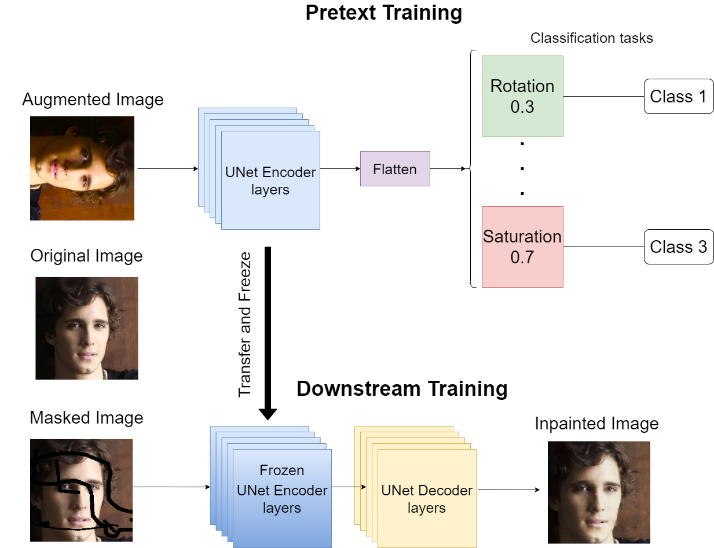

<!-- # WSSL-Weighted-Self-Supervised-Learning-for-Image-Inpainting -->
<br />
<p align="center">

  <h1 align="center">WSSL: Weighted-Self-Supervised-Learning-for-Image-Inpainting</h1>
  
  <p align="center">
    Image inpainting using a weighted self supervised learning architecture
    <br />
  </p>
</p>

# Abstract
<p align="justify">
    Image inpainting is the process of regenerating lost parts of the image. Supervised algorithm-based methods have shown excellent results but have two significant drawbacks. They do not perform well when tested with unseen data. They fail to capture the global context of the image, resulting in a visually unappealing result. We propose a novel self-supervised learning framework for image-inpainting: Weighted Self-Supervised Learning (WSSL) to tackle these problems. We designed WSSL to learn features from multiple weighted pretext tasks. These features are then utilized for the downstream task, image-inpainting. To improve the performance of our framework and produce more visually appealing images, we also present a novel loss function for image inpainting. The loss function takes advantage of both reconstruction loss and perceptual loss functions to regenerate the image Our experimentation shows WSSL outperforms previous methods, and our loss function helps produce better results.
    <br />
</p>

<br>
<p align="center">
     
</p>

# Dataset links
- [Tiny Imagenet-200](https://github.com/seshuad/IMagenet)
- [CelebA-HQ](https://www.kaggle.com/datasets/badasstechie/celebahq-resized-256x256)
- [QD-IMD](https://www.kaggle.com/datasets/ideanvidia/qd-imd-30-50)

# Pretrained weights
The weight names follow the following naming convention
```<task-1>-<task-2>-<task-1-weight>-<task-2-weight>```. They are the final weights to be used by the model for inference.
| <b> Downstream task weight combination </b>    | <b> Download link </b>                               |
| -------------                           | -------------                                     |
| Sharpness-Saturation-70-30              | [here](https://drive.google.com/file/d/1CP4vJekB3ryEupq_E7qf41dswengMYhb/view?usp=share_link)             |
| Sharpness-Saturation-90-10             | [here](https://drive.google.com/file/d/1zOk16iztj57y62cU5McKDj9NwrsL14UE/view?usp=share_link)           |
| Rotation-Saturation-30-70                | [here](https://drive.google.com/file/d/1V2HI9nMdq3ZGnM7vqoYSL4vp4rkvZPHQ/view?usp=share_link)         |

# Reference
If you find our work useful, please cite using
### plaintext
```
Gupta, S., Ravishankar, R. K., Gangaraju, M., Dwarkanath, P., & Subramanyam, N. (2022). WSSL: Weighted Self-Supervised Learning Framework for Image-Inpainting. In Y. Xiao, A. Abraham, G. Chao Peng & J. Roth (Eds.), Proceedings of the International Conferences Computer Graphics, Visualization, Computer Vision and Image Processing, Connected Smart Cities, Big Data Analytics, Data Mining and Computational Intelligence and Theory and Practice in Modern Computing 2022  (pp.111-119). Lisbon, Portugal: IADIS Press. ISBN: 978-989-8704-42-9
```
### bibtex
```latex
@incollection{GuptaRavishankarGangarajuDwarkanathSubramanyam2022,
author = {Gupta, S. and Ravishankar, R. K. and Gangaraju, M. and Dwarkanath, P. and Subramanyam, N.},
booktitle = {Proceedings of the International Conferences Computer Graphics, Visualization, Computer Vision and Image Processing, Connected Smart Cities, Big Data Analytics, Data Mining and Computational Intelligence and Theory and Practice in Modern Computing 2022 .},
editor = {Xiao, A. Abraham and G. Chao Peng and J. Roth},
pages = {111-119},
publisher = {IADIS Press.},
title = {WSSL: Weighted Self-Supervised Learning Framework for Image-Inpainting},
year = {2022},
}
```

## License
This work is licensed under the [MIT License](./LICENSE)